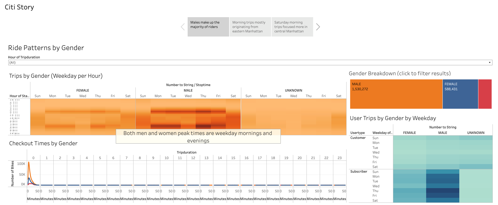
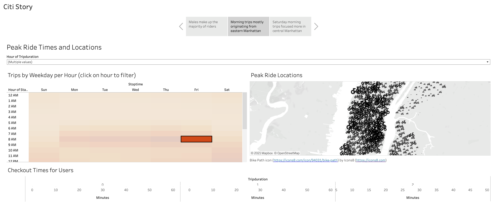
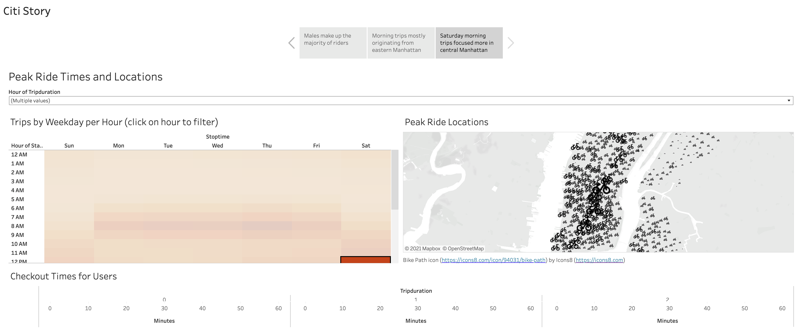
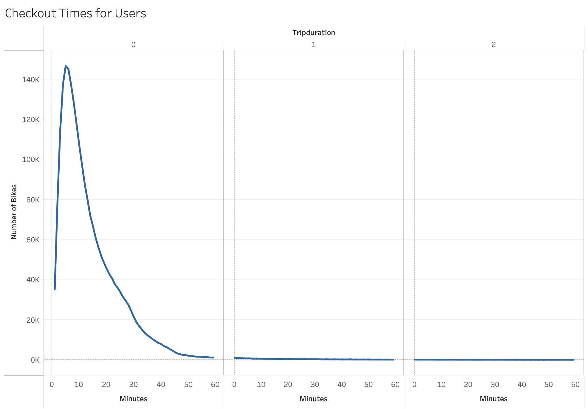

# Overview
Citi Bike data for New York City was analyzed to investigate the feasibility of a similar startup business in Des Moines, Iowa.  Ride trip data including gender, location, and time of day were imported to Tableau to generate visualizations to analyze key questions.  

# Results
A few patterns emerged as the data visualizations were developed.  

Men by far made up the majority of riders (at almost 3X the number of females).  

There appeared to be a pattern of weekday commutes originating from the east side of Manhattan, heading towards the central section of Manhattan.  

There also appeared to be a large number of weekend riders that originated in the central portion of Manhattan.

Lastly, trip duration is very short, across all genders, with the vast majority of rides lasting 10 minutes or less.  There are very few rides that last over an hour.  

# Summary
While there appears to be a high level of usage for Citi Bike in New York City, there are some additional factors that need to be investigated to ensure similar success in Des Moines.  For one, the population density in New York City is vastly different than Des Moines.  While New York City trips are typically short (less than 10 minutes), these could be much longer trips in Des Moines if the population is more spread out.  This could mean more bike maintenance, as well as lower interest in bikes as a means of transportation, since there are other modes that could be quicker.  Additionally, the impact of traffic levels on choosing bikes over cars should be considered.  The traffic levels in Des Moines are likely much lower than NYC, which would drive a lower need to choose a bike over a car.

Additonal findings can be explored in the full Tableau workbook at the following link:

[Tableau Public bikesharing_challenge workbook](https://public.tableau.com/app/profile/zack.scott/viz/bikesharing_challenge_16325835945830/CitiStory?publish=yes)